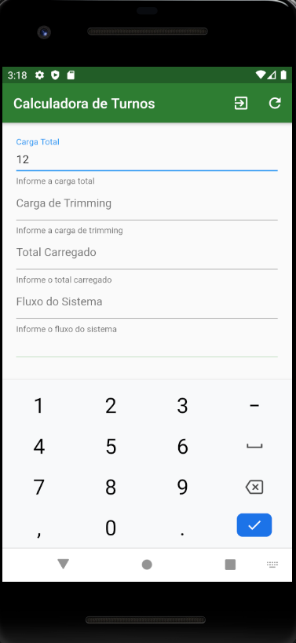
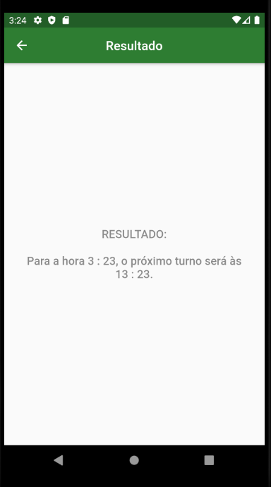
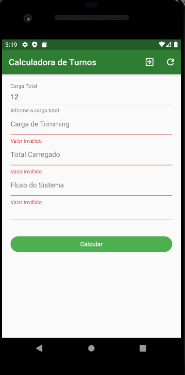

# Calculadora de Turnos

O seguinte aplicativo foi solicitado por um colaborador isolado, com o objetivo de gerenciar os turnos para a realização da carga de minério para os navios. O aplicativo calcula com base em algumas entradas, a hora exata que o operador deverá recarregar o próximo navio à atracar no porto..

## Tecnologias Usadas
Para o aplicativo, foram usadas as seguintes tecnologias:  
- Dart (Linguagem de Programação)
- Flutter (*Framework*)
- Android Studio (IDE)
  
  
  
## Visão geral do sistema
O sistema desenvolvido é bastante simples, sendo composto apenas de duas telas: a principal, que recebe os dados fornecidos pelo operador, e a tela de resultado, que exibe o horário para a próxima carga. Não existe a necessidade de guarda de dados para o protótipo solicitado pelo usuário. Segue abaixo a demonstração do aplicativo final. 

  
  

  
  
O *app* conta com um sistema de verificação de preenchimento dos campos obrigatórios, já nativo do *widget* usado (*Form*) para a criação da página. Quando o usuário tentar calcular o resultado da próxima carga sem fornecer todos os campos obrigatórios, o *app* impede que o fluxo natural do sistema siga, não mostrando nenhum resultado ao usuário, como mostra o exemplo abaixo:  

  

